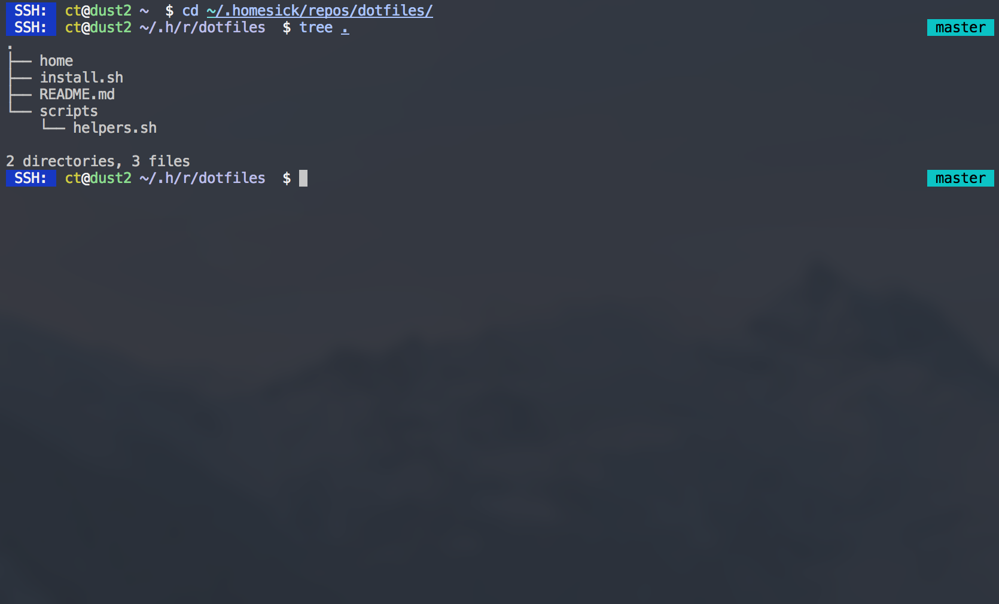

# dotfiles
## Finally, I put my dotfiles on Github !

### What you get
- git
- brew
- rbenv + ruby 2.2.2 + bundle
- node + npm
- heroku-toolbelt
- awscli
- autojump
- [fish shell](http://fishshell.com/)
- [oh-my-fish](//github.com/oh-my-fish/oh-my-fish) framework
- Some custom functions like be (bundle exec), etc.

### Installation
```
gem install homesick
homesick clone th3m4ri0/dotfiles
homesick symlink dotfiles
homesick exec dotfiles chmod+x install.sh
homesick exec dotfiles ./install.sh
```

### What it looks like


### Adding stuff
- ```homesick track [~/.file] dotfiles```
- ```homesick commit dotfiles [COMMIT_MESSAGE]```
- ```homesick push dotfiles```
